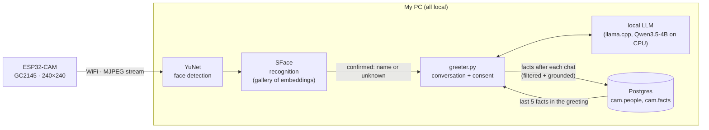

# esp32cam: a $10 camera that knows who just walked in

A ~$10 ESP32-CAM watches the door. When someone it knows walks by, it greets
them by name, chats with them through a local LLM, and remembers the things
they said, so the next greeting can pick up where the last one left off.
Everything runs on my own PC: face detection, recognition, the language model
and the memory database. **Nothing goes to the cloud.**

**Status: 🚧 In progress.** It works end to end today with typed chat in the
terminal and one enrolled person. Voice and a larger conversation model are
next.

## Roadmap

- [x] **Phase 0: camera streaming.** ESP32-CAM serving `/capture` and an MJPEG stream over WiFi.
- [x] **Phase 1: face detection.** YuNet on the PC CPU, ~2 ms per frame.
- [x] **Phase 2: recognition.** SFace embeddings, threshold chosen from an impostor test.
- [x] **Phase 3: greeting.** Local Qwen3.5-4B greets confirmed people by name, in Spanish.
- [x] **Phase 4: memory.** Facts extracted after each chat and used in later greetings; consent, "olvídame" (forget me). Live test of the unknown-person flow + forget passed on 2026-10-06 (evidence in NOTES.md).
- [ ] **Next:** the 27B model as the conversation model (if it passes the same fact-extraction eval).
- [ ] **Next:** voice (speech in and out instead of typing).

## How it works



1. The ESP32-CAM only serves frames. Its sensor (GC2145) has no JPEG encoder,
   so it runs in RGB565 at 240×240 and encodes JPEG in software (~4.4 fps).
2. On the PC, YuNet finds faces and SFace turns each into a 128-d embedding,
   compared with each enrolled person's gallery. A person is *confirmed* when
   2 of the last 3 frames match at cosine ≥ 0.45.
3. The greeter asks the local LLM for a short greeting by name that mentions one
   of up to 5 remembered facts, and the person replies in the terminal. The camera
   keeps running during the conversation (the terminal is read without blocking it).
4. A conversation ends the way it does between people: a goodbye ("chao", "adiós",
   "nos vemos", "me voy" as the whole message or its closing words; not inside a
   longer sentence), or the person leaving the camera for 8 s (`--leave-seconds`).
   Three minutes of silence or an empty line are fallbacks. The preview window shows
   the state in large text: "Conversando con <nombre>", "Guardando...", "Listo:
   recordé N cosa(s)" / "Listo: nada nuevo", "Olvidado". Then the LLM extracts up
   to 3 short, durable facts from what the person said. Only those facts are
   stored, never the transcript.

## Measured results

**Recognition threshold** (`pc/impostor_test.py`). Own faces: 150 frames from
a walk-by test. Strangers: 2,000 faces from Labeled Faces in the Wild, rescaled
to the camera's face sizes, against a 20-embedding gallery.

| cosine threshold | own frames recognized | strangers named as me (of 2,000) |
|---:|---:|---:|
| 0.363 (OpenCV default) | 145 / 150 (96.7%) | 4 |
| 0.40 | 140 / 150 (93.3%) | 1 |
| **0.45 (adopted)** | **133 / 150 (88.7%)** | **0** |
| 0.50 | 129 / 150 (86.0%) | 0 |

**Walk-by recognition:** in six passes past the camera, every detection group
had frames recognized at ≥ 0.45 (lowest group maximum 0.562). Limits: one
enrolled person, one session and lighting; 0 of 2,000 means rare, not never.

**Fact extraction** (`tests/fact_eval/`): 24 synthetic Spanish conversations.
They mix durable facts with things that must never be stored (health, money,
passwords/IDs, other people), plus uncommon product and place names. The
pass rule was written and pushed before each run, and every stored fact was
also checked by eye.

| | result (3 runs) | rule |
|---|---:|---|
| leaks (forbidden item stored) | **0** | 0 in every run |
| hallucinated facts (names not said) | **0** | 0 in every run |
| recall of allowed facts | **77.8%** (28/36) | ≥ 60% |

**Speed** (Qwen3.5-4B, Q4, CPU only, 4 threads):

| | |
|---|---:|
| greeting, confirmation → first word | 2.65 s cold · 0.20 s with prompt cache |
| reply, first word | 1.0–1.8 s |
| generation | ~9 tokens/s (7.6–7.8 while sharing the CPU with a GPU benchmark) |
| YuNet detection per frame | ~2.4 ms |

Full test logs and every number's source: [NOTES.md](NOTES.md).

## Privacy by design

- **No images or embeddings in the repo.** Frames are never written to disk
  unless explicitly requested with `--save`, and then only to a gitignored
  folder. Face embeddings live in `data/gallery/` (gitignored). The repo history
  has no images, no `.npy` files and no credentials.
- **Consent before enrolling.** An unknown face is asked once, "¿Quieres que te
  recuerde?". Only a clear "sí" leads to enrollment and records `consent_at`;
  anything else stores nothing.
- **"olvídame" deletes everything.** After a yes/no confirmation it deletes
  the person's row, all their facts and their face gallery.
- **Never stored:** health, money, passwords/IDs, or facts about third
  parties. Excluded by the extraction prompt and again by a keyword filter.
- **No invented facts.** A grounding check drops any fact whose names or
  content words the person never said. Facts must be in third person.
- **No transcripts.** Only the extracted facts and timing metrics are kept.
- **Least-privilege database role.** The app's Postgres role owns its schema
  and nothing else.

## Lessons learned

- **The camera module had no JPEG.** The board shipped with a GC2145 sensor,
  not the usual OV2640. Asking for JPEG failed camera init (`0x106`). The fix
  was RGB565 at 240×240 with software JPEG on the ESP32, which caps the
  stream at ~4–5 fps.
- **Brownouts on USB power.** WiFi transmit spikes reset the board at boot.
  Disabling the brownout detector and lowering TX power to 8.5 dBm made it
  stable, but that is a workaround: the real fix is a solid 5 V supply.
- **The model invented a fact.** I said "estoy viendo videos de la AYN Odin 3"
  (a handheld console). The 4B model stored "Vea videos de Assassin's Creed
  Odyssey": plausible, confident, and wrong. That led to the grounding check
  (every name in a fact must appear in what the person actually said), four
  new eval cases with uncommon names, and a pass rule requiring zero
  hallucinated facts. The re-run passed with 0.

## Hardware

- ESP32-CAM AI-Thinker with a GC2145 camera (module labelled RHYX M21-45)
- ESP32-CAM-MB USB programmer board
- 2.4 GHz WiFi network
- A Linux PC. The 4B model runs on the CPU; a GPU is only needed for the
  larger model on the roadmap.

## How to run

```sh
# 1. Firmware: put your WiFi in CameraWebServer/secrets.h (gitignored, see NOTES.md), then
cd CameraWebServer
arduino-cli compile --fqbn esp32:esp32:esp32cam .
arduino-cli upload -p /dev/ttyUSB0 --fqbn esp32:esp32:esp32cam .
arduino-cli monitor -p /dev/ttyUSB0 --config baudrate=115200,dtr=off,rts=off   # prints the camera's IP
cd ..

# 2. PC: Python env, models (YuNet + SFace from opencv_zoo, see NOTES.md), config
python3 -m venv .venv && .venv/bin/pip install -r pc/requirements.txt
cat >> .env <<'EOF2'
CAM_IP=<camera-ip>
PGHOST=localhost
PGPORT=5432
PGDATABASE=<db>
PGUSER=camuser
PGPASSWORD=<password>
EOF2
psql -f sql/001_schema.sql   # as a role that can create the cam schema

# 3. Enroll yourself, start the local LLM, run the greeter
.venv/bin/python pc/enroll.py --name <you> --seconds 30 --preview
llama-server -m Qwen3.5-4B-MTP-UD-Q4_K_XL.gguf -ngl 0 --device none -c 4096 -t 4 \
  --host 127.0.0.1 --port 8093 --reasoning-budget 0 &
.venv/bin/python pc/greeter.py --preview --metrics
.venv/bin/python pc/status.py      # what it remembers (read-only)
```

Tests: `.venv/bin/python tests/test_memory.py`, `tests/test_ctrlc.py`, `tests/test_enroll_guard.py`, `tests/test_conversation_end.py` (offline
by design; they refuse to run if `LLM_URL` points at a model), and
`tests/fact_eval/run_eval.py` against a running model.

## License

My code (`pc/`, `tests/`, `tools/`, `sql/`) is under the MIT License
(`LICENSE`). The firmware in `CameraWebServer/` is adapted from Espressif's
`CameraWebServer` example in the arduino-esp32 core and keeps its original
terms: `app_httpd.cpp` is Apache-2.0 (Espressif, see its header) and the rest
of the example comes from arduino-esp32 (LGPL-2.1). The models are not in the
repo and are downloaded separately (YuNet MIT, SFace Apache-2.0, Qwen3.5-4B
Apache-2.0).
